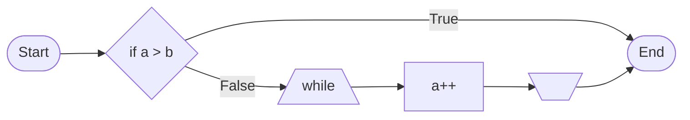
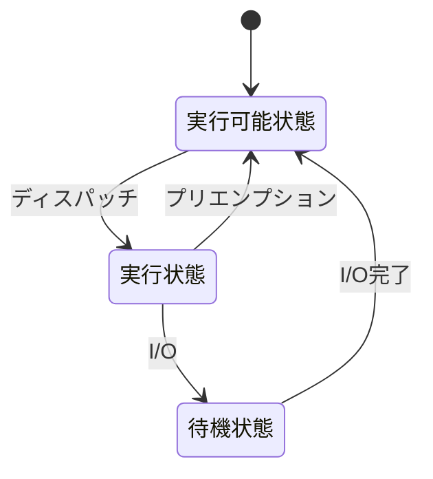
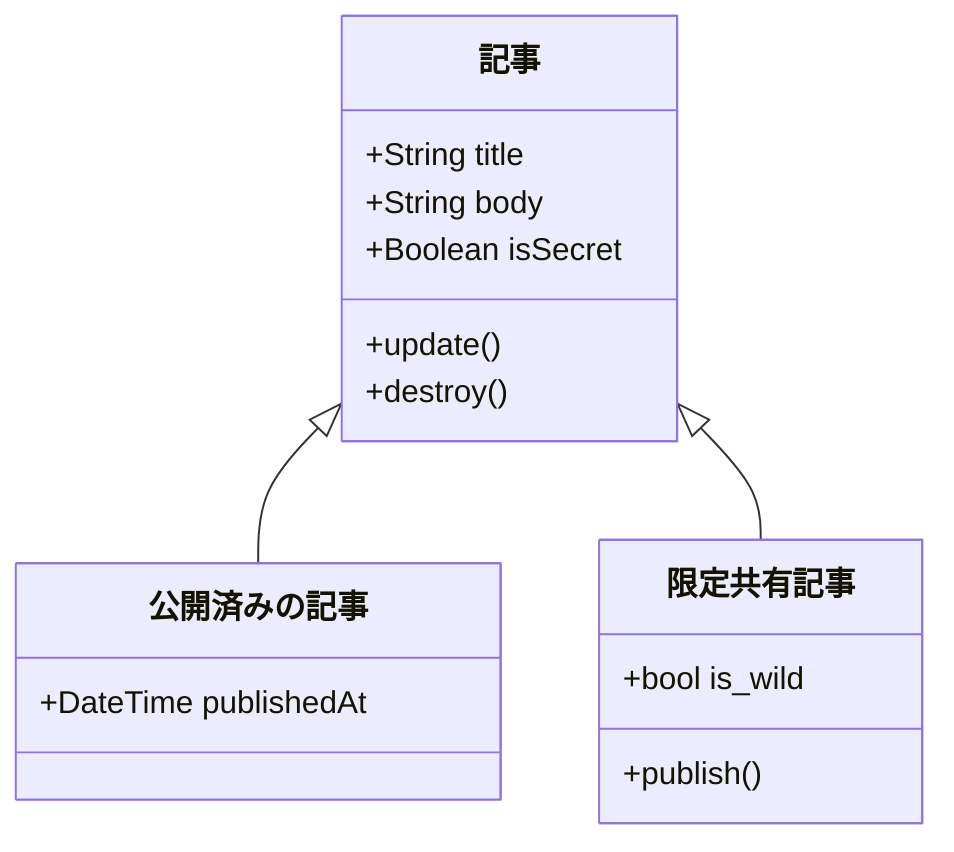
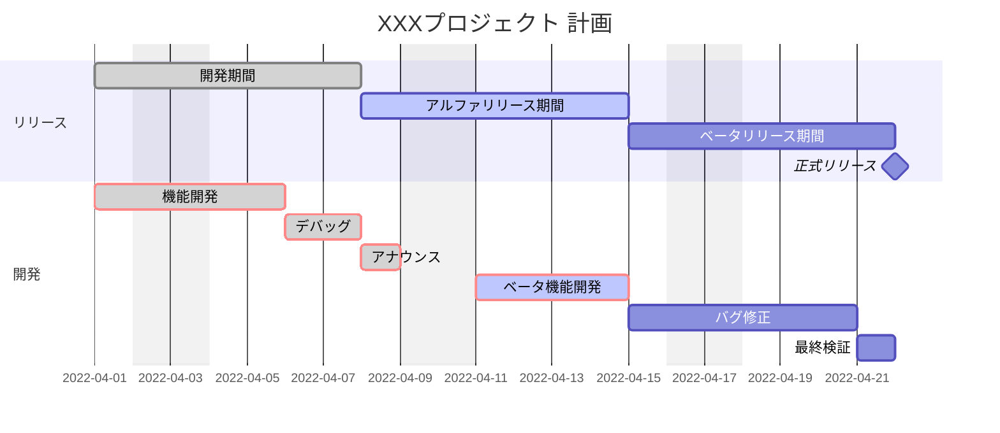
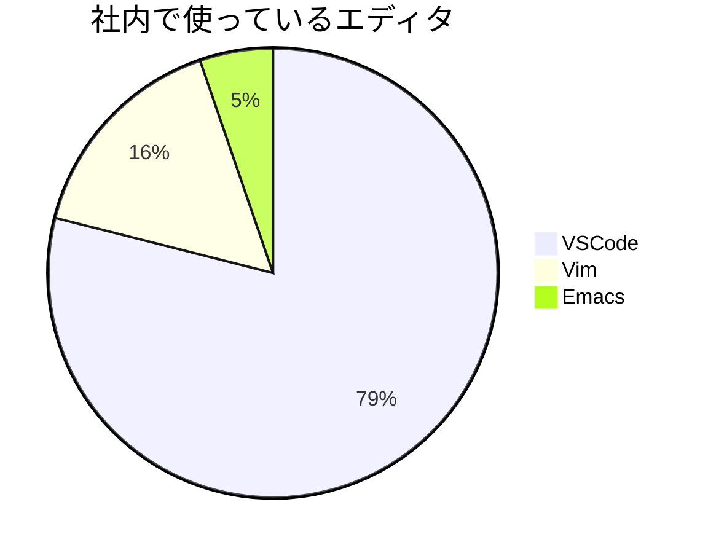

【フローチャート】

```mermaid
graph LR
  Start([Start])-->B{if a > b}
  B-->|True| End
  B-->|False| IFS[/while\]
  IFS-->C[a++]
  C-->IFB[\  /]
  IFB-->End([End])
```

【状態遷移図】

```mermaid
stateDiagram-v2
  [*] --> 実行可能状態
  実行可能状態 --> 実行状態: ディスパッチ
  実行状態 --> 実行可能状態: プリエンプション
  実行状態 --> 待機状態: I/O
  待機状態 --> 実行可能状態: I/O完了
```

【クラス図】

```mermaid
classDiagram
  記事 <|-- 公開済みの記事
  記事 <|-- 限定共有記事
  class 記事{
    +String title
    +String body
    +Boolean isSecret
    +update()
    +destroy()
  }
  class 公開済みの記事{
    +DateTime publishedAt
  }
  class 限定共有記事{
    +bool is_wild
    +publish()
  }
```

【ガントチャート】

```mermaid
gantt
  dateFormat  YYYY-MM-DD
  title       XXXプロジェクト 計画
  excludes    weekends

  section リリース
  開発期間        :done, 2022-04-01, 2022-04-08
  アルファリリース期間 :active, 5d
  ベータリリース期間  :5d
  正式リリース      :milestone, 0d

  section 開発
  機能開発      :crit, done, 2022-04-01, 3d
  デバッグ      :crit, done, 2d
  アナウンス     :crit, done, 1d
  ベータ機能開発 :crit, active, 4d
  バグ修正      :4d
  最終検証      :1d

```

【円グラフ】

```mermaid
pie title 社内で使っているエディタ
  "VSCode" : 30
  "Vim" : 6
  "Emacs" : 2
```

参考
- https://qiita.com/Qiita/items/c07f3262d8f3b25f06c9
